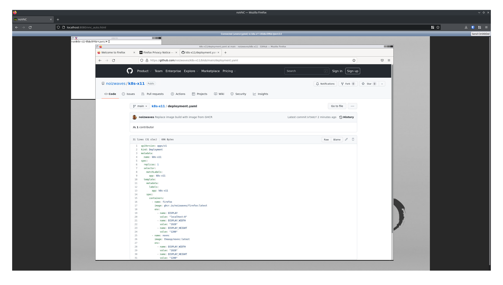

# k8s-x11

Running GUI apps in kubernetes

## Inspiration

- https://www.trickster.dev/post/running-gui-apps-within-docker-containers/
- https://news.ycombinator.com/item?id=30810410
- https://hub.docker.com/r/theasp/novnc

## Installation

1. `minikube start`
1. `docker build -t firefox .`
1. `minikube cache add firefox:latest`
1. `minikube kubectl -- apply -f deployment.yaml`
1. `minikube kubectl -- port-forward pod/<POD NAME> 8080`
1. Open [noVNC](http://localhost:8080/vnc_auto.html)
